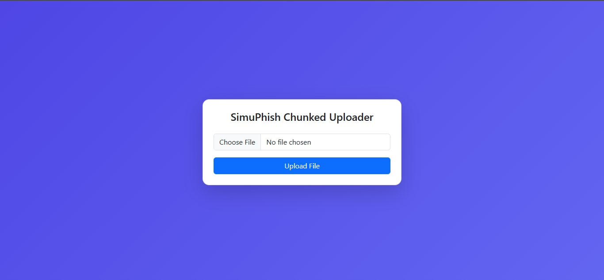
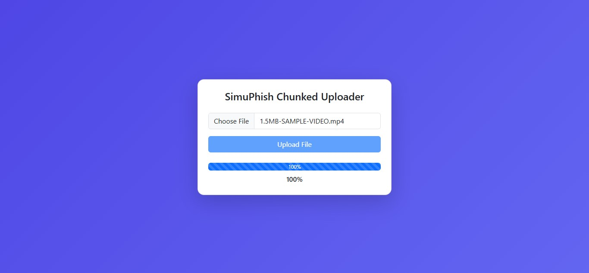
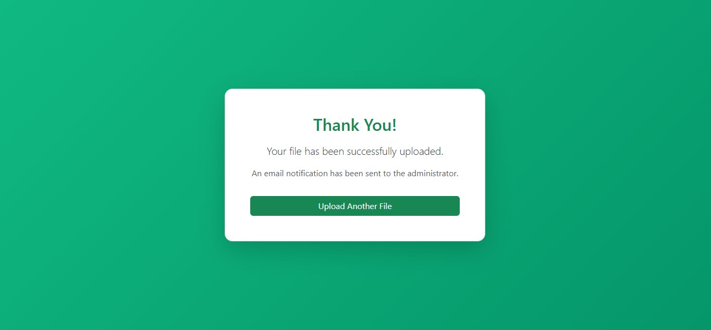
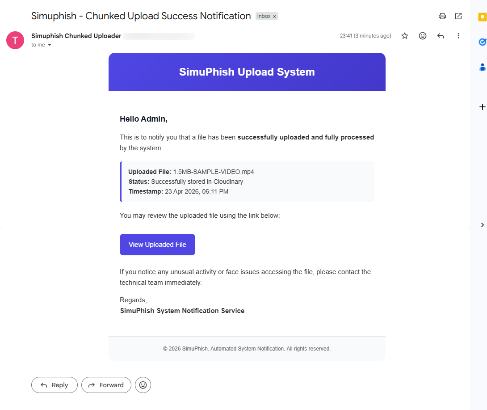

# 🎥 Simuphish Chunked Video Uploader (Laravel + Cloudinary)

This project supports **large video uploads** using a **chunk-based uploader**,  
merging chunks on the server, uploading the final file to Cloudinary,  
and notifying admin via email using Laravel Mail.

---

## 📸 Screenshots






---

## 🚀 Features

- Upload files in chunks (frontend compatible)
- Merge all chunks safely on server
- Upload final file to Cloudinary
- Support for large videos (tested 3MB–300MB)
- Queue-based processing (optional)
- Email notification after successful upload
- Cloudinary secure URLs

---

# 🛠️ Prerequisites

- PHP 8.2+
- Laravel 12.x
- Composer
- Cloudinary account (Free plan works)
- XAMPP/WAMP (for local development)

---

# 📦 Installation

### 1️⃣ Clone the Repository

```sh
git clone https://github.com/taufik-khatik/simuphish-chunked-uploader.git
cd simuphish-chunked-uploader
```

### 2️⃣ Install Dependencies

```sh
composer install
```

### 3️⃣ Configure Environment Variables

```sh
cp .env.example .env
php artisan key:generate
```

### 4️⃣ Run Database Migrations

```sh
php artisan migrate
```

---

# ⚙️ Cloudinary Setup

### 1️⃣ Create Cloudinary Account

1. **Sign up**: Visit [Cloudinary](https://cloudinary.com) and sign up for a free account.
2. **Get Credentials**: After signing up, log in to your [Cloudinary Dashboard](https://cloudinary.com/console) and get your Cloud Name, API Key, and API Secret.
3. And generate a Upload Preset (optional):

```txt
Settings → Upload → Upload Presets → Add Upload Preset
Type: Signed or Unsigned
Folder: uploads
```

### 2️⃣ Configure Environment Variables
Add the following keys to your .env file for Cloudinary configuration:

```sh
CLOUDINARY_CLOUD_NAME=your_cloud_name
CLOUDINARY_API_KEY=your_api_key
CLOUDINARY_API_SECRET=your_api_secret
CLOUDINARY_UPLOAD_PRESET=your_upload_preset (optional)
CLOUDINARY_URL=cloudinary://<your_api_key>:<your_api_secret>@<your_cloud_name>
```

### 3️⃣ Set Filesystem Disk

```sh
FILESYSTEM_DISK=cloudinary
```

### 4️⃣ Email Configuration

Add email configuration to your .env file for email notifications after successful upload:

```sh
MAIL_MAILER=smtp
MAIL_HOST=smtp.gmail.com
MAIL_PORT=587
MAIL_USERNAME=null
MAIL_PASSWORD=null
MAIL_ENCRYPTION=tls
MAIL_FROM_ADDRESS=null
MAIL_FROM_NAME="${APP_NAME}"
```

Additionally, you can set the `ADMIN_EMAIL` instead of using the default `MAIL_FROM_ADDRESS` for getting notifications:

```sh
ADMIN_EMAIL=your_email_address
```

### 5️⃣ Testing Email via Web Route (Optional)

You can test the email notification by accessing the `/test-email` route in your browser.

---

# 📂 config/filesystems.php Update
Add this disk:

```php
'cloudinary' => [
    'driver' => 'cloudinary',
    'url' => env('CLOUDINARY_URL'),
    'cloud' => env('CLOUDINARY_CLOUD_NAME'),
    'key' => env('CLOUDINARY_API_KEY'),
    'secret' => env('CLOUDINARY_API_SECRET'),
    'upload_preset' => env('CLOUDINARY_UPLOAD_PRESET'),
    'secure' => true,
],
```

---

# 📁 Storage Folders
Create chunk merge folders:

```sh
mkdir -p storage/app/chunks
mkdir -p storage/app/temp
```

---

# 🖥️ Usage

### 1️⃣ Start the local server:

```sh
php artisan serve
```

### 2️⃣ (Optional) If using Queues, start the worker:

```sh
php artisan queue:work
```

### 3️⃣ Upload your files through the UI. The system will:

- Split large files into chunks
- Merge them in storage/app/temp.
- Upload to Cloudinary under the `uploads` folder.
- Notify admin via `ADMIN_EMAIL` after successful upload.

---

# 📝 Important Notes
- Execution Time: For large files on XAMPP, increase `max_execution_time` in `php.ini` or use `set_time_limit(0)` in the controller.
- Paths: Always use forward slashes / or realpath() to avoid Windows backslash issues in PHP strings.
- Filesystem: Use the `storage_path()` helper to get the path to the storage directory.

---

# 📚 License

[](https://opensource.org/licenses/MIT)

---

# 👨‍💻 Author

**Developed by: [**Taufik Khatik**](https://taufikkhatik.netlify.app)**

**Hosted by: [**SimuPhish**](https://simuphish.com)**
